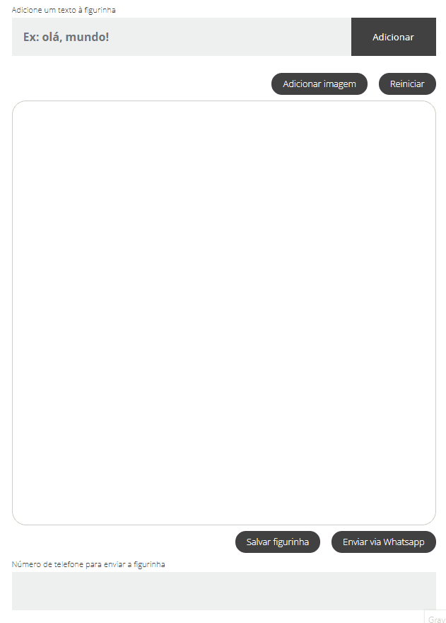

# WhatsApp Sticker Creator

A ideia deste aplicativo é criar figurinhas de WhatsApp para salvar no computador ou enviar para um número de telefone 
qualquer.

### Exemplo de uso

### Bibliotecas utizadas (back-end)

<b>Twilio</b>: API para envio de mensagens de Whatsapp;

<b>Cloudinary</b>: API para gerenciamento de arquivos em nuvem;

<b>Coffecode Router</b>: biblioteca para roteamento;

<b>Twig</b>: template engine para renderização de páginas;

<b>GD</b>: extensão do PHP para gerencamento de arquivos.

### Bibliotecas utizadas (front-end)

<b>Fabric.js</b>: bibloteca javascript para manipulação de elementos em canva;

<b>Font face observer</b>: bibloteca javascript para controlar o carregamento de fontes na aplicação.

### Ideia geral

Uma aplicação onde o usuário consegue criar figurinhas e enviá-las via Whatsapp ou salvá-las localmente no dispositivo.

Ao carregar a tela, o usuário se depara com um canva em branco. Há um text input onde ele pode escrever palavras para
serem inseridas no canva. Há a possibilidade de inserir imagens para compor o canva. Cada imagem inserida sobrepõe a 
anterior (layers). Os textos sempre ficam por cima das imagens.

Após montar a imagem, o usuário pode baixá-la para o seu dispositivo ou enviar diretamente como uma figurinha (sticker)
para um número de whatsapp que desejar.

### Observações

A aplicaçao utiliza a extensão GD do PHP então, para quem desejar rodar o projeto na sua máquina, é necessário ativar 
esta extensão no servidor.
